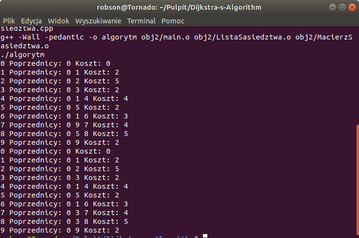

# Dijkstra-s-Algorithm
In this project Dijkstra's algorithm is used to find the shortest path in directed graph represented by matrix and list of neighborhood. Program use RAII mechanism and abstract class Represantation of Graph.

Screen from terminal: 

 
